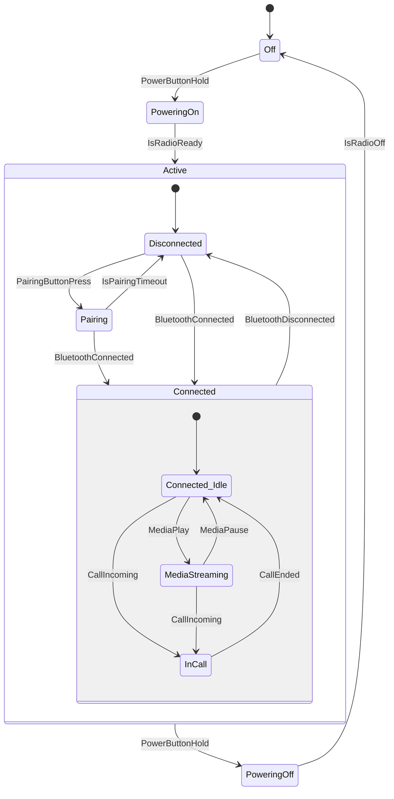

# Stride State Machine Formalization

This document outlines the declarative State Machine syntax for the Stride language, detailing the core schema, execution semantics, and applied use cases. The schema provides structural completeness with respect to standard UML Statecharts and W3C SCXML formalizations.

## Core Schema (`StateMachine.stride`)
**Path:** `strideroot/library/1.0/StateMachine.stride`

The core library defines two universal base types: `_StateType` and `_TransitionType`.

### Architectural Principles
- **Backend-Agnostic Design:** The schema is declarative, defining structural properties rather than platform-specific execution logic. The Stride compiler determines the implementation, generating optimized `enum`/`switch` branching for embedded MCUs or polymorphic JIT compilation for high-level runtime environments.
- **Stream-Driven Actions:** Lifecycle hooks (`onEntry`, `onProcess`, `onExit`) and transition action hooks (`onTransition`/`actions`) strictly accept constrained lists of `_StreamType`. Encapsulating continuous logic within `onProcess` eliminates the need for external polling loops.

---

## State Lifecycle & Execution Semantics

When a state machine processes data, it adheres strictly to the following structural and lifecycle rules:

### Lifecycle Hooks
- `onEntry`: Stream expressions executed exactly once when the state becomes active. For hierarchical states, parent `onEntry` executes before child `onEntry` (Top-Down).
- `onProcess`: Stream expressions executed continuously (per tick/sample) while the state remains active.
- `onExit`: Stream expressions executed exactly once when exiting the state. For hierarchical states, child `onExit` executes before parent `onExit` (Bottom-Up).

### Transitions & Guards
Transitions dictate how the state machine moves from one state to another. They are evaluated sequentially based on their definition order in the `transitions` list.

- `targetState` (or `newState`): The destination state. If omitted or set to `none`, the transition acts as an internal transition (executes `onTransition` actions without exiting or re-entering the current state).
- `guard`: A signal variable, expression block (e.g. `[ GuardSignal > 0 ]`), string/keyword (`none`), or list specifying the guard condition required for the transition.
- `triggerOnGuard`: Switch (`on` / `off`, default `off`). When `on`, the transition triggers directly whenever the guard condition evaluates to true (automatic guard-driven transition).
- `onTransition`: Stream expressions executed while traversing the transition, after state `onExit` streams and before target state `onEntry` streams.

### Discrete Tick Semantics & Transition Timing
In Stride domains, execution occurs in discrete ticks (samples). Within each domain tick, state machine processing follows a deterministic phase order:

1. **Initial Entry Tick (Domain Startup):**
   - If the state machine is not yet entered (`isEntered == false`), the initial state's `onEntry` streams execute top-down, `isEntered` is marked `true`, and the initial state immediately executes its `onProcess` stream in the same initial tick.

2. **Transition Tick (When a Transition Fires):**
   - Transition guards are evaluated (including inherited ancestor transitions).
   - When a transition fires:
     1. `onExit` streams execute bottom-up for the exiting state hierarchy.
     2. History state variables are recorded for any exiting composite state with `resumeLastState: on`.
     3. `onTransition` action streams execute.
     4. The active state ID is updated to the target state (resolving leaf initial or restored history states).
     5. The transition request queue is cleared.
     6. `onEntry` streams execute top-down for the target state hierarchy.
     7. The tick completes.

3. **Steady-State Processing Tick (No Transition Firing):**
   - Transition guards are evaluated (none trigger).
   - `onProcess` streams of the active state execute.
   - If the active state has `isParallel: on`, `onProcess` streams of all its active parallel child regions execute concurrently in the same tick.

> [!NOTE]
> **Separation of Transition and Processing:** `onProcess` streams of a newly entered state begin on the tick *after* the transition fires. This guarantees clear separation between state lifecycle mutations (`onExit`, `onTransition`, `onEntry`) and continuous signal processing (`onProcess`), preventing duplicate or partial sample calculations within a single time slice.

---

## Hierarchical, Parallel & History Formalizations

### Transition Evaluation & Inheritance
- **Order of Evaluation:** Within a state, transitions are evaluated sequentially. If multiple transitions evaluate to true simultaneously, the transition defined highest in the list executes.
- **Hierarchical Preemption & Inheritance:** Active sub-states inherit transitions defined on all ancestor states. Sub-state transitions take precedence over parent transitions. If an ancestor transition fires:
  1. Exit hooks (`onExit`) execute bottom-up from the active leaf sub-state up to the ancestor state owning the transition.
  2. Ancestors with `resumeLastState: on` save the active leaf state ID into their history variable.
  3. `onTransition` action streams execute.
  4. Active state switches to the target state (resolving leaf initial state or restored history state).
  5. Target state entry hooks (`onEntry`) execute top-down.

### Orthogonal Regions (`isParallel: on`)
When `isParallel: on` is specified, all child states in the `states` list become active simultaneously (rather than just `initialState`).
- *Execution:* `onProcess` streams for all active parallel regions execute concurrently each tick.
- *Exiting:* Exiting a parallel parent state executes `onExit` hooks for all active parallel regions before the parent state exits.

### History Pseudo-States (`resumeLastState: on`)
Instructs the state machine to remember the active child sub-state hierarchy when the composite state is exited. Upon re-entry, it restores the hierarchy instead of resetting to `initialState`.
- *First Entry:* If the state has never been entered, it defaults to `initialState`.
- *Final States:* If the state previously reached an `isFinal: on` child state before exiting, re-entry defaults back to `initialState`.

### Completion States (`isFinal: on` & `onDone`)
- `isFinal: on`: Reaching a state marked `isFinal: on` signals completion of its parent composite state.
- `onDone`: Transitions defined on a parent state that evaluate automatically when all active child states reach an `isFinal: on` state.

---

## Implementation Example (Bluetooth Headset)

The following example demonstrates how Stride models a complex embedded system (a Bluetooth headset). It illustrates hardware hooks (`onEntry`/`onExit`), continuous data streams (`onProcess`), guard signals, and hierarchical preemption.



```stride
# Shared hardware signals used by transitions
signal PowerButtonHold { domain: RootDomain type: _IntType }
signal BluetoothConnected { domain: RootDomain type: _IntType }
signal BluetoothDisconnected { domain: RootDomain type: _IntType }
signal CallIncoming { domain: RootDomain type: _IntType }
signal CallEnded { domain: RootDomain type: _IntType }
signal MediaPlay { domain: RootDomain type: _IntType }
signal MediaPause { domain: RootDomain type: _IntType }
signal PairingButtonPress { domain: RootDomain type: _IntType }
signal IsRadioReady { domain: RootDomain type: _IntType }
signal IsRadioOff { domain: RootDomain type: _IntType }
signal IsPairingTimeout { domain: RootDomain type: _IntType }

state BluetoothHeadset {
    states: [Off, PoweringOn, Active, PoweringOff]
    initialState: Off
}

state Off {
    onEntry: [ EnterDeepSleep(); ]
    
    transitions: [
        transition {
            guard: PowerButtonHold
            targetState: PoweringOn
        }
    ]
}

state PoweringOn {
    onEntry: [ 
        WakeRadio(); 
        PlayPowerOnChime(); 
    ]
    
    transitions: [
        transition {
            guard: IsRadioReady
            targetState: Active
        }
    ]
}

state PoweringOff {
    onEntry: [ 
        PlayPowerOffChime(); 
        DisconnectRadio(); 
        EnterDeepSleep(); 
    ]
    
    transitions: [
        transition {
            guard: IsRadioOff
            targetState: Off
        }
    ]
}

# The Active state is hierarchical. 
# A PowerButtonHold transition here acts globally for all sub-states, 
# preempting them and routing to PoweringOff.
state Active {
    states: [Pairing, Disconnected, Connected]
    initialState: Disconnected
    
    transitions: [
        transition {
            guard: PowerButtonHold
            targetState: PoweringOff
        }
    ]
}

state Pairing {
    onEntry: [ 
        EnableDiscoverableMode(); 
        PlayPairingPrompt(); 
    ]
    onProcess: [ FlashBlueRedLED(); ]
    onExit: [ DisableDiscoverableMode(); ]
    
    transitions: [
        transition {
            guard: BluetoothConnected
            targetState: Connected
        },
        transition {
            guard: IsPairingTimeout
            targetState: Disconnected
        }
    ]
}

state Disconnected {
    onProcess: [ FlashBlueLED_Slow(); ]
    
    transitions: [
        transition {
            guard: BluetoothConnected
            targetState: Connected
        },
        transition {
            guard: PairingButtonPress 
            targetState: Pairing
        }
    ]
}

# The Connected state handles distinct operational modes (media vs calls)
state Connected {
    states: [Connected_Idle, MediaStreaming, InCall]
    initialState: Connected_Idle
    
    onEntry: [ PlayConnectedChime(); ]
    onExit: [ PlayDisconnectedChime(); ]
    
    transitions: [
        transition {
            guard: BluetoothDisconnected
            targetState: Disconnected
        }
    ]
}

state Connected_Idle {
    onProcess: [ DoubleFlashBlueLED(); ]
    
    transitions: [
        transition {
            guard: MediaPlay
            targetState: MediaStreaming
        },
        transition {
            guard: CallIncoming
            targetState: InCall
        }
    ]
}

state MediaStreaming {
    onEntry: [ ConfigureAudioHighQuality(); ]
    onProcess: [ StreamAudioData(); ]
    
    transitions: [
        transition {
            guard: MediaPause
            targetState: Connected_Idle
        },
        transition {
            # An incoming call preempts media streaming
            guard: CallIncoming
            targetState: InCall
        }
    ]
}

state InCall {
    onEntry: [ 
        ConfigureAudioLowLatency(); 
        EnableMicrophone(); 
    ]
    onProcess: [ StreamVoiceData(); ]
    onExit: [ DisableMicrophone(); ]
    
    transitions: [
        transition {
            guard: CallEnded
            targetState: Connected_Idle 
        }
    ]
}
```

---

## Future Work

### Immediate Processing & Run-to-Completion (`immediateProcessOnTransition`)
While the default discrete tick semantics (executing transitions and state entry in one tick, and `onProcess` in the subsequent tick) provide deterministic behavior for synchronous domains (like DSP and audio), future versions could introduce an optional configuration flag:

- **`immediateProcessOnTransition: on`**:
  Allows event-driven domains to optionally execute the newly entered state's `onProcess` stream immediately within the transition tick. This enables micro-step chaining and Run-to-Completion (RTC) semantics for UI and asynchronous event-queue processing without waiting for the next sample boundary.

